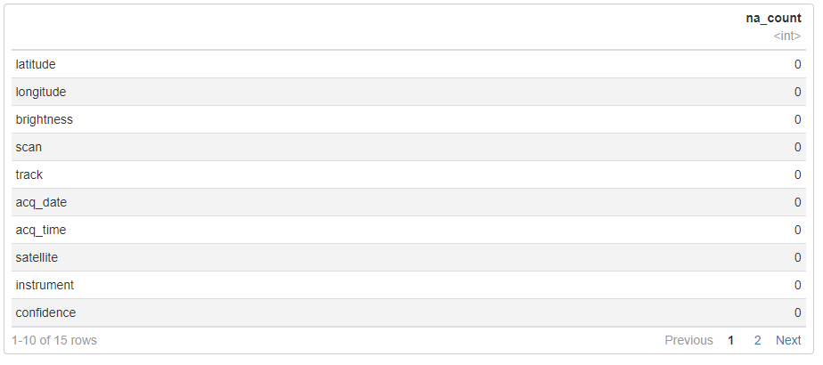

# ANALISIS KORELASI PADA DATA FIRE MODIS MENGGUNAKAN PRINCIPAL COMPONENET ANALYSIS (STUDI KASUS: NEGARA PERU, TAHUN 2010-2015)

## A. Business Understanding
MODIS merupakan singkatan dari MODerate resolution Imaging Spectroradiometer. MODIS merupakan instrumen kunci dalam satelit NASA Aqua & Terra, dan didesain khusus untuk mendeteksi kebakaran hutan. NASA menyediakan data titik api aktif dari instrumen MODIS tersebut pada laman [FIRMS](https://firms.modaps.eosdis.nasa.gov/active_fire) yang memungkinkan publik untuk mengakses data titik api dalam rentang waktu tertentu. Dalam dataset tersebut, terdapat beberapa atribut yang tersedia, mulai dari lokasi latitude dan longitude, brightness, scan, track, acquired date, acquired time, satellite, instrument, confidence, version, bright_t31, frp, daynight, dan type. Melalui proses pengolahan data yang tepat, dapat diketahui variabel apa yang paling berperan pada data api tersebut.

### A.1. Problem Statement
Berdasarkan permasalahan yang ada, akan dilakukan analisis korelasi untuk mempelajari kedekatan hubungan antarvariabel dan melihat sejauh mana variabel tersebut terkait satu sama lain. Rumusan masalahnya menjadi:
-   Variabel apa yang paling berpengaruh pada data api?
-   Bagaimana visualisasi correlation coefficient, scatter plot principal component, dan diagram hasil prediksi model?
-   Bagaimana hasil evaluasi dengan cross validation?
 
### A.2. Metodologi
Principal Component Analysis digunakan untuk menganalisis variabel apa yang paling berpengaruh pada data api. Untuk mengetahui jumlah faktor/komponen optimum, dilakukan Factor Analysis. Selan itu, pada pembahasan UAS ini juga dikembangkan model prediksi kekuatan radiasi titik aping menggunakan metode regresi linear, di mana evaluasi dilakukan menggunakan cross validation.

### A.3. Metriks
Metriks yang digunakan untuk mengevaluasi kinerja model yang dikembangkan adalah MAE, RMSE, dan Rsquared.

## B. Data Understanding
Data yang digunakan adalah data titik api yang diperoleh dari instrumen MODIS yang tersedia pada website NASA. Dataset yang dipilih merepresentasikan data titik api negara Peru pada rentang waktu 2010-2015. Data terdiri atas 87.282 record dengan variabel berjumlah 15. Adapun variabel-variabel pada dataset ini, yaitu: latitude, longitude, brightness, scan, track, acquired date, acquired time, satellite, instrument, confidence, version, bright_t31, frp, daynight, dan type.

### B.1. Exploratory Data Analysis
Variabel-variabel pada dataset titik api MODIS mewakili informasi yang dapat dijelaskan sebagai berikut [2].
-   latitude & longitude
Lokasi titik tengah pixel 1km yang ditandai mengandung satu atau lebih api/hotspot (ukuran api tidak 1km, tetapi bervariasi).
-   brightness
Temperatur kecerahan yang diukur (dalam Kelvin) menggunakan MODIS channel 21/22 dan channel 31.
-   scan & track
Resolusi spasial aktual dari pixel yang dipindai. Nilai scan menggambarkan resolusi spasial di arah timur-barat pemindaian dan nilai track menggambarkan resolusi spasial utara-selatan pemindaian. Meskipun algoritma bekerja pada resolusi 1km, pixel MODIS menjadi lebih besar menuju ke tepi pemindaian. Pixel di tepi “Timur” dan “Barat” pemindaian lebih besar dari 1 km. Ukuran 1 km ada disepanjang nadir (tepat vertikal dari satelit). Oleh karena itu, nilai yang ditampilkan untuk scan dan track menggambarkan resolusi spasial aktual dari pixel yang dipindai.
-   acquired date & acquired time
Tanggal akuisisi dari pixel hotspot/api aktif dan waktu lewat satelit dalam UTC (penyajian pelanggan dalam waktu lokal).
-   satellite
Satelit yang mendeteksi titik api tersebut, apakah Terra atau Aqua. Sebagai penambah konteks, instrumen MODIS terdapat pada satelit Pengamatan Bumi (EOS) Terra (EOS AM) dan Aqua (EOS PM) NASA. Orbit satelit Terra bergerak dari utara ke selatan melintasi khatulistiwa pada pagi hari dan Aqua melewati selatan ke utara di atas khatulistiwa pada sore hari, sehingga memberikan pengamatan global setiap 1-2 hari.
-   instrument,
Instrumen yang digunakan dalam pengumpulan data titik api. Pada kasus ini, instrumennya adalah MODIS. Instrumen lain yang dapat melakukan pendeteksian titik api adalah VIIRS S-NPP.
-   confidence
Kepercayaan deteksi adalah tanda kualitas dari tiap pixel titik api aktif/hotspot.
-   version
Versi mengacu pada koleksi pemrosesan dan sumber data. Angka sebelum titik desimal mengacu pada koleksi (misalnya MODIS Collection 6). Angka setelah titik desimal menunjukkan sumber data Level 1B; (1) data yang diproses dalam waktu hampir nyata oleh MODIS Rapid Response (MRR) akan memiliki kode sumber “CollectionNumber.0”. (2) Data yang berasal dari MODAPS (dengan keterlambatan 2 bulan) dan diproses oleh FIRMS menggunakan algoritma MOD14/MYD14 Thermal Anomalies standar akan memiliki kode sumber “CollectionNumber.x”.
Sebagai contoh, data dengan versi yang tercantum sebagai 5.0 adalah koleksi 5, diproses oleh MRR, data dengan versi yang tercantum sebagai 5.1 adalah data koleksi 5 yang diproses oleh FIRMS menggunakan data Level 1B dari MODAPS.
-   bright_t31
Temperatur kecerahan dari pixel hotspot/api aktif (dalam Kelvins) pada channel 31.
-   frp
Fire Radiative Power. Menggambarkan kekuatan radiatif api yang terintegrasi pixel dalam MW (MegaWatts). FRP memberikan informasi tentang keluaran panas yang terukur dari api yang terdeteksi. Jumlah panas radiasi yang dilepaskan per satuan waktu (Fire Radiative Power) dianggap terkait dengan tingkat bahan bakar yang terbakar (Wooster et. al., 2005).
-   daynight,
Menandakan observasi titik api terjadi pada siang atau malam hari [4].
    -   D = titik api pada siang hari
    -   N = titik api pada malam hari
-   type
Menandakan jenis observasi titik api.
    -   0 = dugaan kebakaran vegetasi
    -   1 = gunung berapi aktif
    -   2 = sumber tanah statis lainnya
    -   3 = deteksi lepas pantai (mencakup semua deteksi di permukaan air)

Berdasarkan deskripsi variabel di atas, dapat diketahui bahwa
-   terdapat 8 variabel yang bernilai numerik, yaitu latitude & longitude, brightness, scan & track, confidence, bright_t31, dan frp.
-   terdapat 2 variabel yang bertipe data date, yaitu data acquired date & acquired time.
-   terdapat 5 variabel yang bernilai kategori, yaitu satellite, instrument, version, daynight, dan type.

Selanjutnya, dilakukan pengecekan terhadap informasi dalam dataset modis Peru 2010-2015. Berdasarkan hasil pengecekan terhadap informasi tipe data, tidak semua variabel memiliki tipe data yang sesuai.
-   Variabel satellite, instrument, version, daynight, dan type akan diubah menjadi bertipe categorical/factor
-   Variabel acq_date akan diubah menjadi bertipe date

### B.2. Menangani Missing Value
Sebelum melakukan analisis menggunakan PCA, perlu dipastikan bahwa tidak ada data yang bernilai null. Berdasarkan hasil pengecekan, tidak ada data yang bernilai null. Dengan demikian, tidak ada record bernilai null yang perlu dibuang dari dataset.

### B.3. Univariate Analysis
Untuk fitur numerik, dapat dilihat histogram masing-masing fitur sebagai berikut.

Berdasarkan histogram di atas, dapat diperoleh informasi diantaranya:
-   Peningkatan nilai brightness, scan, track, dan frp sebanding dengan penurunan jumlah sampel. Hal ini dapat dilihat dari histogram masing-masing variabel tersebut yang grafiknya mengalami penurunan seiring dengan semakin besarnya nilai variabel.
-   Lebih dari setengah nilai confidence bernilai di atas 50.

### B.4. Multivariate Analysis
Pada tahapan ini, dilakukan pengamatan terhadap hubungan antarfitur numerik. 

Fungsi pairs pada R menunjukkan relasi pasangan dalam dataset. Korelasi pada fitur tampak dari adanya pola pada sebaran data. Sebaran data acak merupakan indikasi korelasi yang lemah (atau tidak ada korelasi sama sekali), sedangkan sebaran data yang memiliki pola (tidak acak) merupakan indikasi adanya korelasi. Pada pola sebaran data grafik di atas, terlihat adanya korelasi positif antara variabel “scan” dan “track”. Korelasi positif ditandai dengan meningkatnya variabel pada sumbu y saat terjadi peningkatan variabel pada sumbu x. Selain itu, terlihat variabel “brightness” memiliki korelasi positif dengan variabel “frs”. Korelasi juga terlihat antara variabel “brightness” dengan “bright_t31”

## C. Preprocessing
Pada tahapan preprocessing, dilakukan serangkaian proses transformasi pada data sehingga menjadi bentuk yang cocok untuk proses analisis PCA nantinya. Sebelumnya, diketahui bahwa variabel “version” dan “instrument” hanya memiliki satu nilai unik, yaitu “6.2” untuk version dan “MODIS” untuk instrument. Maka dari itu, variabel ini tidak diikutkan karena tidak memberikan informasi yang berarti dalam proses analisis. Maka dari itu, variabel “version” dan “instrumen” akan dihapus dari dataset.

### C.1. Encoding Fitur Kategori
Proses encoding akan menghasilkan fitur baru yang sesuai sehingga dapat mewakili variabel kategori.Pada dataset MODIS Peru 2010-2015 yang penulis gunakan, variabel “satellite” dan “daynight” merupakan variabel bertipe kategorik yang hanya memiliki 2 nilai kategori. Metode encoding yang dapat digunakan ialah dummy coding. Karena hanya ada satu atribut yang dikodekan sebagai 1 dan yang lainnya sudah pasti 0, dummy encoding dikenal juga sebagai one-hot encoding 

Selain itu, juga terdapat variabel “type” yang memiliki 4 nilai kategori yang unik, yang mewakili 4 tipe titik api. Untuk mengencode data ini, digunakan metode [label encoding](https://www.analyticsvidhya.com/blog/2020/03/one-hot-encoding-vs-label-encoding-using-scikit-learn) yang merepresentasikan tiap kategori dalam nilai numerik. Nilai yang mewakili tiap tipe sesuai dengan nomor tipenya masing-masing, yaitu 0, 1, 2, dan 3.

### C.2. Transformasi Data Date acq_date dan acq_time
Agar informasi yang ada dalam variabel acq_date dan acq_time dapat ikut diolah, maka variabel tersebut perlu diubah ke dalam tipe data numerik dengan menggunakan fungsi as.numeric(). Namun, pertama-tama data tanggal dan jam perlu digabungkan terlebih dahulu, baru kemudian di ubah kedalam integer. Fungsi akan mengembalikan jumlah detik yang telah berlalu sejak tanggal 1/1/1970 (penanggalan awal pada Unix).

Proses transformasi menghasilkan dataset sebagai berikut.

## D. Jumlah Faktor
Tahapan ini bertujuan untuk menentukan jumlah faktor/komponen yang akan diekstrak. Metode yang digunakan untuk menentukan jumlah faktor ini ialah dengan [menginspeksi scree plot](https://www.dominodatalab.com/blog/how-to-do-factor-analysis).

Pada scree plot, setiap faktor atau komponen tambahan hanya akan menghasilkan pengurangan nilai eigen secara marjinal setelah titik tertentu. Pengurangan yang tidak signifikan akan memberikan gambaran semacam ‘siku’ yang dihasilkan oleh grafik. Dengan mengikuti metode “Elbow Rule”, didapatkan angka “5” sebagai angka tertinggi yang memenuhi, yang merupakan titik di mana nilai varians masih berkurang secara signifikan.

Cara lain yang dapat digunakan untuk memeriksa ulang jumlah faktor yang akan diekstrak ialah menggunakan analisis paralel. Analisis pararel dalam The Journal of Vegetaion Science dideskripsikan sebagai berikut: Dalam parallel analysis, nilai eigen dari sebuah data sebelum rotasi dibandingkan dengan nilai eigen dari matriks nilai acak dengan dimensi yang sama (p variabel dan n sampel). Tujuan dari perbandingan ini adalah untuk menentukan nilai eigen mana yang tidak signifikan dibandingkan dengan nilai eigen yang dihasilkan secara acak. Nilai eigen yang dianggap tidak signifikan adalah nilai eigen yang berada di bawah nilai eigen yang dihasilkan secara acak.

Berdasrakan kode tersebut, paralel analysis menyarankan jumlah faktor bernilai 5 dan jumlah komponen bernilai 5. Pada kode tersebut, metode yang digunakan untuk estimasi skor faktor adalah "Maximum Likelihood" yang ditandai dengan parameter fm="ml". 

Dalam proses [factor analysis](https://www.dominodatalab.com/blog/how-to-do-factor-analysis), akan dilakukan interpretasi terhadap Rotation. Rotasi dapat dikategorikan menjadi dua, ortogonal dan oblique. Rotasi ortogonal mengasumsikan bahwa faktor-faktor yang ada tidak berkorelasi, sedangkan rotasi oblique mengasumsikan bahwa faktor-faktor tersebut berkorelasi. Dua jenis rotasi yang populer adalah Varimax (ortogonal), dan Oblimin (miring). Pada tahapan analisis ini, penulis menggunakan rotasi oblimin

Berdasarkan output di atas, terlihat nilai RMSEA index sebesar 0.048. Nilai ini sudah memenuhi rule of thumb, di mana rule of thumb standard dari nilai RMSEA index ialah kurang dari .06.

Selanjutnya, dilakukan pengamatan terhadap faktor terakhir. Pada faktor ML5, nilai loadings yang dihasilkan tidak ada yang tinggi, yang menandakan bahwa faktor tersebut tidak penting. Untuk itu, dilakukan pengujian untuk nilai faktor=4.

Metriks yang dihasilkan untuk faktor = 4 tidak begitu buruk, meskipun nilai RMSEA index mencapai 0.065. Selanjutnya, dilakukan inspeksi faktor sebagai berikut.

Pada tabel loading tersebut, terlihat bahwa variabel-variabel terkait dengan satu faktor utama.
-   Variabel scan dan track berkolerasi positif kuat dengan faktor ML3
-   Variabel brightness, confidence, dan frp berkolerasi positif kuat dengan faktor ML1
-   Variabel latitude berkorelasi positif kuat dengan faktor ML2, sedangkan variabel longitude berkolerasi positif kuat dengan faktor tersebut.
-   Variabel daynight berkolerasi positif kuat dnegan faktor ML4
Dengan demikian jumlah faktor yang dapat digunakan untuk proses analisis selanjutnya adalah 4.

## E. Koefisien Korelasi

Berdasarkan hasil plot koefisien korelasi , dapat diketahui informasi sebagai berikut.
-   Terdapat korelasi positif yang kuat antara brightness dan frp. Hal ini ditandai dengan nilai positif 0.67 yang menunjukkan adanya hubungan positif. Artinya, jika brightness (temperatur kecerahan, dalam Kelvin) meningkat, maka fire radiative power juga cenderung meningkat, dan sebaliknya, jika brightness menurun, nilai kekuatan radiatif titik api juga cenderung menurun. Korelasi yang kuat dapat diartikan sebagai hubungan yang cukup kuat antara kedua variabel tersebut. 
-   Terdapat korelasi yang kuat antara brightness dan confidence, dengan nilai 0.60. Artinya, jika brightness meningkat, confidence juga cenderung meningkat, dan sebaliknya, jika brightness menurun, frp juga cenderung menurun. Jadi, jika nilai temperatur kecerahan (dalam Kelvin) yang terdeteksi meningkat, besar kemungkinan nilai confidence/kepercayaannya juga besar.
-   Terdapat korelasi yang sangat kuat terlihat antara variabel track dan scan, dengan nilai 0.98. Hal ini mungkin terjadi karena keduanya merupakan informasi tentang resolusi spasial dari pixel yang dipindai, yang saling terkait satu sama lain. Sebagai contoh, jika resolusi spasial di arah utara-selatan (track) meningkat, maka resolusi spasial di arah timur-barat (scan) juga mungkin akan meningkat, dan sebaliknya.
-   Korelasi lainnya terlihat antara variabel brightness dan brigh_t31. Korelasi ini mungkin terjadi sebab keduanya sama-sama mengukur kecerahan, di mana variabel brightness mengukur temperatur kecerahan pada channel 21/22 dan 31, sedangkan temperatur bright_t31 mengukurnya pada channel 31 (sama-sama mengukur pada channel 31).
-   Korelasi negatif yang kuat terlihat antara variabel latitude dan longitude. Hal ini dipengaruhi oleh kondisi geografis yang penulis analisis, yaitu negara Peru yang terletak di -12.433333, -77.283333.

## F. PCA dan Visualisasi Scatter Plot
Principal Component Analysis dilakukan dengan menggunakan fungsi prcomp. Perlu diperhatikan bahwa normalisasi data merupakan hal yang [penting untuk dilakukan](https://stats.stackexchange.com/questions/69157/why-do-we-need-to-normalize-data-before-principal-component-analysis-pca) sebelum melakukan PCA, sehingga perlu ditambahkan parameter scale = True.

Untuk mengetahui variabel yang paling dominan dalam pembentukan principal component, penulis melihat matriks rotasi yang menunjukkan kontribusi masing-masing variabel terhadap setiap komponen utama. Setelah itu, urutkan kolom dari matriks tersebut berdasrakan nilai yang ada. Selanjutnya, dicari nilai indeks yang mengandung nilai terbesar dalam setiap komponen utama. Indeks kolom akan menunjukkan variabel apa yang paling banyak membentuk komponen utama.

Kemudian, lihat indeks kolom dengan nilai terbesar dalam setiap komponen utama, di mana indeks dimulai dari 0

Hasil PCA dapat divisualisasikan menggunakan Scatter Plot, dengan hasil sebagai berikut

Berdasarkan hasil analisis terhadap nilai loadings hasil PCA tersebut, diketahui variabel yang paling berpengaruh dalam pembentukan komponen prinsipal adalah daynight, frp, latitude, bright_t31, confidence, longitude, scan, dan type. Variabel pembentuk 4 faktor pertama adalah bright_t31, daynight, longitude, dan latitude. 

## G. Fitting Model Diagram
Pada tahapan E, telah dilakukan analisi korelasi menggunakan matriks koefisien korelasi. Berdasarkan informasi tersebut, terdapat variabel yang memiliki korelasi yang sangat rendah, sehingga tidak akan diikutkan dalam proses pelatihan.Variabel-variabel yang tidak akan diikutkan dalam proses pelatihan tersebut diantaranya adalah type, acq_datetime, dan satellite.

Selain itu, dalam linear regression dikenal juga multicollinearity. Pada kasus ini, dua variabel memiliki nilai koefisien korelasi yang mendekati 1, seperti yang terjadi antara variabel scan dan track. Multicollinearity akan mempengaruhi kinerja dari model regresi yang dibuat. Untuk itu, kedua variabel ini juga akan dihapus. Dataset kemudian akan dibagi ke dalam data train dan test dengan persentase 70:30. Target dari regresi ini adalah nilai FRP atau fire radiative power.

Selanjutnya, dilakukan pemodelan menggunaan metode regresi, sehingga akan dihasilkan diagram pelatihan model. Model regresi yang digunakan memiliki frp sebagai target, dengan variabel longitude, latitude, brightness, confidence, bright_t31, daynight, scan, dan track sebagai feature vector. Berdasarkan hasil pelatihan, didapatkan nilai MAE, RMSE, dan R2 sebagai berikut.

## H. Cross Validation
Berdasarkan hasil evaluasi cross validation terhadap model linear regression yang dibuat, diperoleh nilai RMSE 0.5669, MAE 0.230, dan nilai Rsquare 0.683. Nilai evaluasi regresi yang kecil ini menandakan bahwa model yang dilatih telah mampu mempelajari dataset MODIS Peru 2010-2015 yang ada.
